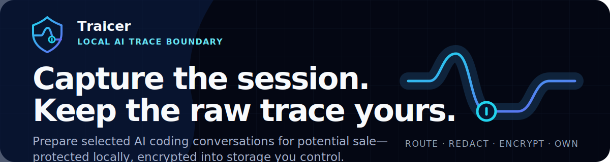

# Traicer

<p align="center">
  
</p>

<p align="center">
  <a href="https://www.npmjs.com/package/@traice-market/traicer"></a>
  <a href="https://github.com/smashah/traicer/releases/latest"></a>
  <a href="./docs/THREAT_MODEL.md"></a>
</p>

Traicer is for developers who want to offer selected AI coding conversations for potential sale through [Traice Market](https://traice.market) without giving the platform a copy of their working history. You are the seller and your storage remains the source of truth. Traicer runs on your machine, captures only supported provider calls you deliberately route through it, removes known secrets, encrypts accepted traces, and writes the ciphertext to S3-compatible storage you control.

A **trace** is the redacted request body and successful response body from one supported Anthropic or OpenAI call, together with its provider, model, client, timestamp, token usage, response status, and redaction report. If the client sent system instructions, code, repository context, tool definitions, tool calls, or tool results inside that provider payload, those values can be present after redaction. Traicer does not independently crawl your repository, watch processes, or record unrelated network traffic.

> [!WARNING]
> Traicer is an operator preview, not a general-purpose data-loss-prevention system. Its built-in detectors cannot guarantee that every sensitive value will be found. Begin with non-sensitive work, verify [release checksums](https://github.com/smashah/traicer/releases/latest), and review the [preview limits](#compatibility-and-preview-limits) before using it with production repositories.

## See it working

This is the current CLI output shape with synthetic identifiers and no trace contents. It shows a healthy local capture service running without a Traice Market account, then the safe local inventory created by two successful provider calls.

```text
$ traicer status
Daemon: running (pid 48120)
Capture: healthy
Storage database: ready
Seller storage: ready
Gateway: ready at http://127.0.0.1:<random-port>
Marketplace: account not connected
Manifests: 0 reconciled, 2 pending

$ traicer traces list --limit 2
TRACE ID                              STATE             PROVIDER    CLIENT          CAPTURED
11111111-1111-4111-8111-111111111111  manifest_pending  anthropic   claude-code     2026-07-18T09:42:11.000Z
22222222-2222-4222-8222-222222222222  manifest_pending  openai      codex           2026-07-18T09:39:04.000Z
```

`traces list` exposes bounded lifecycle metadata only. Use `traicer explore` when you deliberately want to download, verify, decrypt, and inspect one of the underlying traces.

## What stays where

| Location | Data kept there |
| --- | --- |
| **Your machine** | Provider traffic you routed through Traicer; secret stripping, redaction, canonicalisation, encryption, signing keys, and the local inventory database |
| **Your S3-compatible bucket** | AES-256-GCM encrypted trace objects and temporary encrypted delivery objects |
| **Traice Market, when connected** | Signed safe metadata: provider, model, client, hour-rounded capture time, token and tool-call counts, encrypted size, redaction counts, hashes and opaque commitments, pipeline versions, and storage-integrity status |

Traice Market does not receive the request or response body, provider or storage credentials, encryption keys, raw object location, or a reusable storage credential. “Content-free inventory” means that the marketplace receives the metadata listed above, not that it receives no metadata. Those fields are designed to support compatibility and size checks before any seller-approved content delivery.

## From capture to an optional sale

1. **Route one supported call.** Your coding client sends a request through Traicer's loopback gateway or explicit proxy. Traicer accepts only configured providers, methods, and paths.
2. **Protect it locally.** The provider credential is forwarded to the fixed HTTPS provider, but transport credentials are removed before a capture record is constructed. The accepted request and successful response bodies then pass through redaction and canonicalisation.
3. **Commit ciphertext to your storage.** Traicer encrypts the canonical trace locally and reports capture success only after seller storage returns matching metadata and bytes.
4. **Queue safe metadata.** Traicer signs the content-free inventory record. Without a Traice Market account it stays in the durable local outbox. After you add an account credential and restart Traicer, startup reconciliation submits pending records idempotently.
5. **Approve any commercial action.** Capture alone does not create a dataset, accept a sale, or prepare delivery. A seller-approved delivery decrypts only the selected traces on your machine, re-encrypts them for that delivery, and creates a short-lived buyer capability.

Traicer prepares traces for potential sale; it does not promise that a trace will be listed, requested, accepted, or purchased. If Traice Market account enrolment is not available to you yet, local-first capture and owner inspection still work without it.

To connect an account later, stop capture, add `TRAICER_MARKETPLACE_CREDENTIAL` to `~/.config/traicer/.env.local`, encrypt the new value, and restart. The next startup reconciles the pending safe metadata:

```sh
bunx @traice-market/traicer stop
bunx @traice-market/traicer secrets
bunx @traice-market/traicer start --detach
```

## Make the first capture

You need an Anthropic or OpenAI credential and a dedicated Cloudflare R2, AWS S3, or compatible S3 bucket. A Traice Market account is optional at capture time. The desktop app bundles the local service; the CLI requires Bun 1.3 or newer, and managed Cloudflare/AWS deployment shells out to `pnpm`, which must already be installed.

CLI initialization is AI-provider agnostic: one storage configuration includes both Anthropic and OpenAI capture routes. The client launched with `traicer run`, or the API path used with a revealed gateway URL, selects the route for each session.

### Complete Cloudflare R2 + CLI path

This path creates the bucket and reaches a verifiable first trace. Wrangler account discovery and Alchemy deployment authentication are separate: Traicer reads only public account metadata from Wrangler, while Alchemy handles its own browser-based deployment login.

1. Install and authenticate Wrangler, then initialise Traicer and explicitly deploy the generated R2 stack:

   ```sh
   wrangler login
   bunx @traice-market/traicer init --storage cloudflare-r2 --deploy
   ```

2. After deployment succeeds, create a Cloudflare R2 S3 API token with object read/write access restricted to the generated bucket. `init` does not create or reuse this credential. Put its access-key ID and secret into `~/.config/traicer/.env.local`; leave the generated `varlock(...)` references unchanged.

3. Encrypt the external credentials, start the service in the background, and confirm that its storage probe passes:

   ```sh
   bunx @traice-market/traicer secrets
   bunx @traice-market/traicer start --detach
   bunx @traice-market/traicer status
   ```

4. Inside the repository you want to associate with the session, link it once and launch Claude through a temporary scoped route:

   ```sh
   bunx @traice-market/traicer project link
   bunx @traice-market/traicer run -- claude
   ```

5. Send a successful Claude request, exit the session, then verify the safe local row and inspect it deliberately:

   ```sh
   bunx @traice-market/traicer traces list
   bunx @traice-market/traicer explore
   ```

For AWS or an existing compatible service, use the matching command in [Storage](docs/STORAGE.md). `init` never overwrites an existing configuration, and cloud deployment occurs only with `--deploy` or explicit interactive approval.

### Desktop path

Use the desktop app when the bucket and scoped S3 credentials already exist and you want guided configuration:

1. Download the DMG, Windows EXE/MSI, or Linux DEB from the [latest release](https://github.com/smashah/traicer/releases/latest) and verify its checksum.
2. Enter the bucket endpoint, bucket name, region, prefix, and scoped storage credentials. Choose local-first capture when you do not yet have a Traice Market account.
3. Start Traicer and copy the displayed gateway URL into the coding client's provider base-URL setting while keeping its normal provider API key configured.
4. Send a supported request and check **Local trace lifecycle** for the new safe summary.

The displayed loopback URL contains a bearer capability. Do not commit it, place it in a shared shell profile, or include it in screenshots and issues.

## What redaction does today

The current `strict-default` pipeline removes transport headers such as `authorization`, `cookie`, `x-api-key`, proxy authorization, OpenAI organisation/project headers, and any header name that looks like a key, credential, password, secret, session, or token. Those headers are not part of the canonical trace schema.

Within request and response bodies, it replaces sensitive field names and recognises these built-in string patterns:

- private keys;
- OpenAI-style keys;
- AWS access-key IDs;
- JSON Web Tokens;
- PostgreSQL, MySQL, and MongoDB connection URLs;
- email addresses.

The redaction report records only detector categories and replacement counts. Detection is necessarily incomplete, so route only work you are willing to inspect and use `traicer explore` before committing any dataset.

## Inspect and export your traces

Owner access reads the local inventory while the daemon and traice.market are offline. A reveal accepts only a known local trace ID, ciphertext hash, or exact object key already recorded under the configured prefix; it cannot browse arbitrary bucket keys.

```sh
# Safe metadata only
bunx @traice-market/traicer traces list

# Interactive TUI with lazy download/decrypt progress
bunx @traice-market/traicer explore

# Deliberate single-trace reveal
bunx @traice-market/traicer traces show <trace-id>

# Explicit export and plaintext-cache control
bunx @traice-market/traicer traces export <trace-id> --output ./trace.json
bunx @traice-market/traicer traces cache status
bunx @traice-market/traicer traces cache clear
```

Before returning plaintext, Traicer verifies the ciphertext hash, decrypts locally, verifies the canonical hash, and validates the trace schema. Inspected plaintext is gzip-compressed under the configuration directory, capped at 512 MiB by default, and removed after seven days. Terminal output, confirmed clipboard copies, the desktop/TUI detail pane, and exported files contain sensitive plaintext.

## Capture and compatibility

Traicer does not change the system proxy or inject itself into coding tools. Fixed-gateway routes outside the allowlist are rejected; selected explicit-proxy traffic outside the capture set is forwarded without becoming a trace.

| Provider | Captured after a successful response | Forwarded without capture |
| --- | --- | --- |
| Anthropic | `POST /v1/messages` | Token counting and model lookup |
| OpenAI | `POST /v1/responses`, `POST /v1/chat/completions` | Embeddings and model lookup |

Provider forwarding is fail-open: if the provider responds but later persistence fails, the client still receives that response. Persistence is fail-closed: an unknown policy, parser, redaction, encryption, storage, or signing state creates no seller object or marketable inventory.

### Compatibility and preview limits

As of 18 July 2026, the repository documents this acceptance evidence:

| Surface | Current evidence |
| --- | --- |
| Claude Code 2.1.212 on macOS through Anthropic Messages | Manual end-to-end acceptance |
| OpenAI Responses and Chat Completions | Unit and synthetic gateway evidence |
| Codex and OpenCode scoped launchers | Unit and synthetic launcher evidence |
| macOS desktop | Apple Silicon and Intel DMGs are published; not notarised or production-signed |
| Windows desktop | EXE/MSI installers are published; not production-signed |
| Debian/Ubuntu desktop | DEB package is published; clean-machine coverage remains a release gate |

The version-one threat model assumes one local desktop user. Traicer cannot protect traces from malware running with that user's privileges or from a compromised operating system. Security claims remain provisional until the corresponding packet-capture, clean-machine, crash-recovery, and external-review gates pass.

## Documentation and support

- [Getting started](docs/GETTING_STARTED.md) — the complete clean-machine walkthrough.
- [CLI reference](docs/CLI.md) — service commands, routing, trace access, and generated files.
- [Desktop app](docs/DESKTOP.md) — installation, local CA trust, updates, and capture controls.
- [Client configuration](docs/CLIENT_CONFIGURATION.md) — fixed gateway and explicit-proxy setup.
- [Storage](docs/STORAGE.md) — required permissions and storage-backend setup.
- [Architecture](docs/ARCHITECTURE.md), [threat model](docs/THREAT_MODEL.md), and [telemetry contract](docs/TELEMETRY.md) — the security design in detail.
- [Troubleshooting](docs/TROUBLESHOOTING.md) — startup, routing, storage, and capture failures.

Open reproducible, content-free bugs in [GitHub Issues](https://github.com/smashah/traicer/issues). Report vulnerabilities through [GitHub's private security advisory flow](https://github.com/smashah/traicer/security/advisories/new). Never include raw traces, prompts, source code, credentials, private keys, storage URLs, capability-bearing gateway URLs, or unredacted diagnostics in an issue.

## Licence status

Official packages and installers are published for operator-preview evaluation, but the source repository has no distribution licence. Source availability does not grant permission to redistribute the code, publish modified distributions, or describe Traicer as open source.
